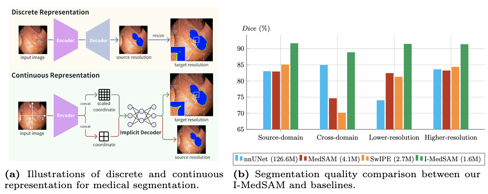
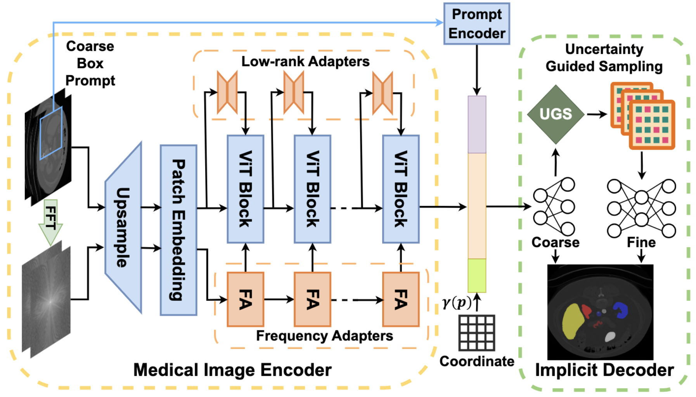

# I-MedSAM: Implicit Medical Image Segmentation with Segment Anything

> [I-MedSAM: Implicit Medical Image Segmentation with Segment Anything](https://arxiv.org/pdf/2311.17081)  
> [Xiaobao Wei](https://ucwxb.github.io/)$^\dagger$, [Jiajun Cao](https://scholar.google.com/citations?user=femNsd0AAAAJ&hl=zh-CN)$^\dagger$, Yizhu Jin, [Ming Lu](https://lu-m13.github.io/), [Guangyu Wang](https://www.google.com/url?sa=t&rct=j&q=&esrc=s&source=web&cd=&cad=rja&uact=8&ved=2ahUKEwjOy7q0osSHAxXjimMGHWxCH0kQFnoECBMQAQ&url=https%3A%2F%2Fteacher.bupt.edu.cn%2Fwangguangyu%2Fzh_CN%2Findex.htm&usg=AOvVaw0JsJrguFMwnFNErS7bO11H&opi=89978449), [Shanghang Zhang](https://www.shanghangzhang.com/)$^\ddagger$   
> ECCV2024 Main Conference Paper  
> $\dagger$ Equal contribution $\ddagger$ Corresponding author




I-MedSAM with the fewest trainable params (1.6M) surpasses the state-of-the-art discrete and implicit approaches and exhibits a solid generalization ability when facing data shifts. 

## News
- **[2024/7/26]** Training & evaluation code release!
- **[2024/7/1]** I-MedSAM is accepted by ECCV2024!

## Overview


We propose I-MedSAM, a model that leverages the benefits of both continuous representations and SAM, aiming to enhance cross-domain capabilities and achieve precise boundary delineation. Given the medical images, I-MedSAM extracts the features from SAM with the proposed frequency adapter, which aggregates high-frequency information from the frequency domain. These features along with the grid coordinates are decoded into segmentation outputs by the learned INRs. We employ a two-stage implicit segmentation decoder, consisting of two INRs in a coarse-to-fine manner. The first INR produces coarse segmentation results and features. Subsequently, a novel uncertainty-guided sampling strategy is applied to sample Top-K variance feature points along with their corresponding grid coordinates. Finally, these selected samples are fed into the second INR to obtain refined segmentation results. Notably, I-MedSAM is trained end-to-end with a minimal number of trainable parameters, yet it achieves state-of-the-art performance compared with all baseline methods.


## Getting Started

### Environmental Setups
Our code is developed on Ubuntu 20.04 using Python 3.8 and pytorch=1.12.0+cu113. We recommend using conda for the installation of dependencies.

```bash

git clone https://github.com/ucwxb/I-MedSAM
cd I-MedSAM
conda env create -f environment.yml
conda activate imedsam
```

### Preparing Dataset and checkpoint of SAM
To validate the performance of binary polyp segmentation, we have provided the [link](https://drive.google.com/drive/folders/12Tmkjx5Xf47Kc-HUpDBZGV1H73VIifab?usp=sharing) for datasets sessile-Kvasir and CVC. 
Please create a new folder named "dataset", download and unzip the two datasets into the folder.

```bash
mkdir dataset
# download and move the zip files into the folder

unzip sessile-Kvasir.zip
unzip CVC.zip
```
Please donwload ViT-B SAM checkpoint from this [link](https://dl.fbaipublicfiles.com/segment_anything/sam_vit_b_01ec64.pth) and place it into the "sam_ckp" folder.
```bash
mkdir sam_ckp
cd sam_ckp
wget https://dl.fbaipublicfiles.com/segment_anything/sam_vit_b_01ec64.pth
```
Finally the file structure is organized as:
```
I-MedSAM
├── dataset
│   ├── sessile-Kvasir
│   |   ├── train
│   |   ├── val
│   |   ├── test
│   ├── CVC
│   |   ├── PNG
│   |   |   ├── Ground Truth
│   |   |   ├── Original
├── sam_ckp
│   ├── sam_vit_b_01ec64.pth
└── other codes...
```

### Training

For training on sessile-Kvasir with the image shape 384x384, please run:
```bash
# for single GPU
bash scripts/train/train_sessile.sh

# for multi GPU. The current settings are for 8 GPUs. If you have less GPUs, please change CUDA_VISIBLE_DEVICES and nproc_per_node.
bash scripts/train/train_sessile_multi.sh
```
Then you can find checkpoints and training logs into the folder "work_dir".

### Evaluation and Visualization
The checkpoint trained on sessile-Kvasir can be found [here](https://drive.google.com/file/d/1qd1FNoc3Io2g8t9HCjaELNYxOHLoiVO0/view?usp=sharing). 
Please download it and place it into the folder "work_dir".
You can follow the test scripts for testing on different experiments settings:
```bash
# test with shape 384x384
bash scripts/test/test_sessile.sh

# cross resolution: from 384 to 128, it changes the param "--label_size" from 384 to 128
bash scripts/test/test_sessile_384_to_128.sh

# cross resolution: from 384 to 896, it changes the param "--label_size" from 384 to 896
bash scripts/test/test_sessile_384_to_896.sh

# cross domain: from sessile-Kvasir to CVC, it set the param "--data_path" to the path of CVC
bash scripts/test/test_sessile_to_CVC.sh
```
You can also modify the param "--resume" as the path of your trained checkpoint.
The test process also supports running on multi GPU, which is the same as training. 
Please refer to the test scripts to change from single GPU into multi GPU.

to visualize the segmentation masks, you can add the argument "--save_pic" into the scripts to save results.

## Citation

If you find this project helpful, please consider citing the our paper:
```
@article{wei2024imedsam,
  title={I-MedSAM: Implicit medical image segmentation with segment anything},
  author={Wei, Xiaobao and Cao, Jiajun and Jin, Yizhu and Lu, Ming and Wang, Guangyu and Zhang, Shanghang},
  booktitle={European Conference on Computer Vision},
  year={2024},
  organization={Springer}
}
```